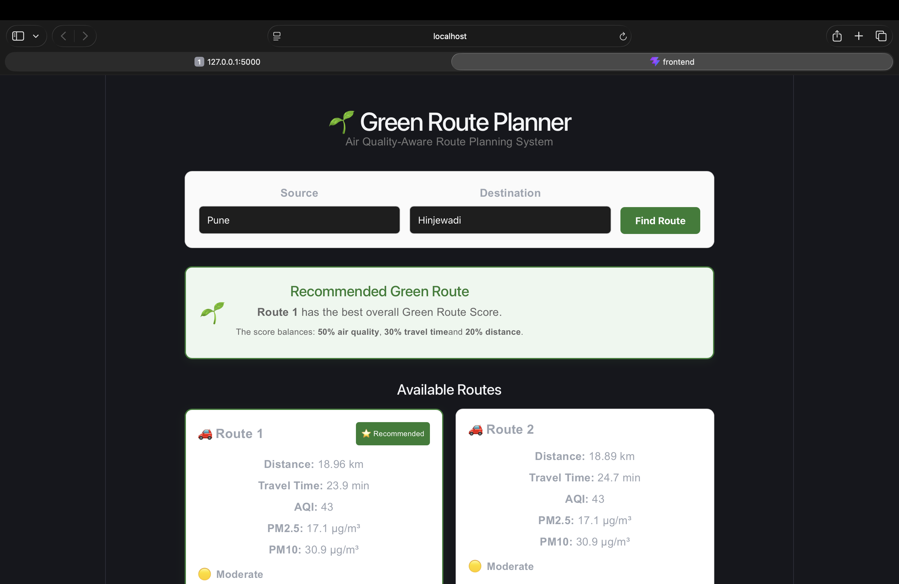
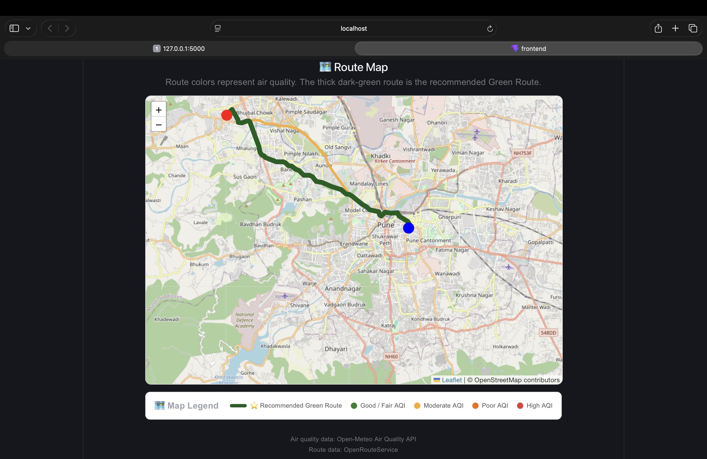
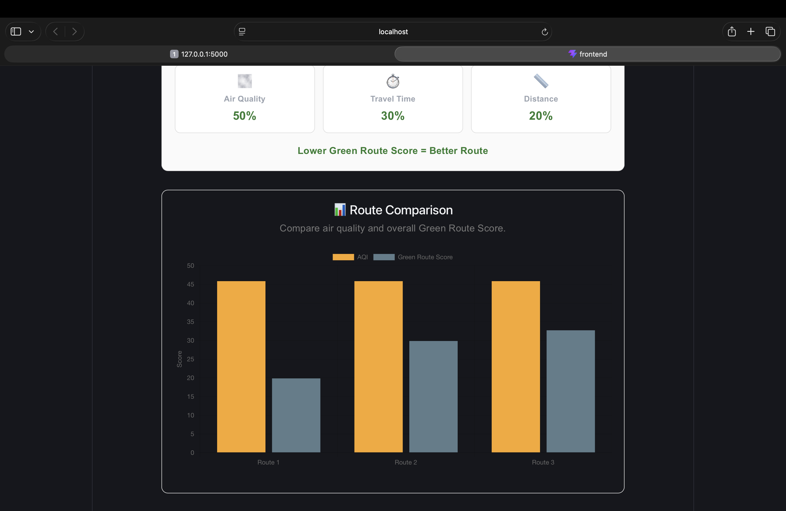

# 🌱 Green Route Planner

### Air Quality-Aware Route Planning System

Green Route Planner is a web-based route planning application that recommends a route by considering not only **distance and travel time**, but also **air quality**.

The system retrieves multiple driving routes and evaluates the air quality along each route using AQI and particulate matter data. A **Green Route Score** is then calculated to identify the most environmentally suitable route.

---

## 📸 Project Preview

### 🏠 Route Search & Dashboard



### 🗺️ Route Map



### 📊 Route Comparison



> **Note:** Add your actual screenshots inside the `images` folder using the filenames shown above.

---

## 🎯 Objective

Traditional route planners primarily optimize for:

- Distance
- Travel time
- Traffic

Green Route Planner introduces **air quality** as an additional factor.

The system analyzes alternative routes and recommends the route that provides the best overall balance between:

- 🌫️ Air Quality
- ⏱️ Travel Time
- 📏 Distance

---

## ✨ Features

- 📍 Source and destination search
- 🚗 Driving route generation
- 🔀 Alternative route detection
- 🌫️ Air Quality analysis
- 📊 AQI, PM2.5 and PM10 information
- 🌱 Green Route Score
- ⭐ Automatic recommended route
- 🗺️ Interactive Leaflet map
- 📈 Route comparison chart
- 🎨 AQI-based route visualization
- 📌 Source and destination markers
- 💻 Responsive web interface
- 🔌 REST API-based backend architecture

---

## 🏗️ System Architecture

```text
                    ┌───────────────────────┐
                    │        USER           │
                    │ Source + Destination  │
                    └───────────┬───────────┘
                                │
                                ▼
                    ┌───────────────────────┐
                    │   PRESENTATION LAYER  │
                    │                       │
                    │ React.js              │
                    │ Leaflet.js            │
                    │ Chart.js              │
                    └───────────┬───────────┘
                                │
                                ▼
                    ┌───────────────────────┐
                    │   APPLICATION LAYER   │
                    │                       │
                    │ Flask / Python        │
                    │ REST API              │
                    │ Route Processing      │
                    │ AQI Analysis           │
                    │ Green Route Scoring   │
                    └───────┬───────┬───────┘
                            │       │
              ┌─────────────┘       └─────────────┐
              ▼                                   ▼
    ┌───────────────────┐              ┌────────────────────┐
    │ OpenRouteService  │              │ Open-Meteo         │
    │                   │              │ Air Quality API    │
    │ Route Geometry    │              │                    │
    │ Distance          │              │ European AQI       │
    │ Travel Time       │              │ PM2.5              │
    │ Alternatives      │              │ PM10               │
    └───────────────────┘              └────────────────────┘
                            │
                            ▼
                    ┌───────────────────────┐
                    │      DATA LAYER       │
                    │                       │
                    │ Route Details         │
                    │ AQI Readings          │
                    │ Scores                │
                    └───────────────────────┘